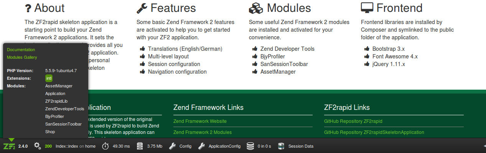

# ZF2rapid tutorial

In this tutorial you will learn how to create an application step by step with
ZF2rapid.

 * [Create new project](tutorial-create-project.md)
 * [Create new module](tutorial-create-module.md)
 * [Create controllers and actions](tutorial-create-controllers-actions.md)
 * [Create routing and generate maps](tutorial-create-routing-maps.md)
 * [Create view helper and controller plugin](tutorial-create-view-helper-controller-plugin.md)

## Create new module

Creating a new module is quite easy. You only have to specify the name of the 
new module. Optionally, you can specify the project path to create the module. 
Otherwise the new module will be created in the current working dir, if it 
contains a Zend Framework 2 project. During creation you will be asked in which 
of your application configuration files the new module should be activated. 

We want to create a new module with the name `Shop`. Please choose the 
`development.config.php` configuration file to activate the new module in.

    $ zf2rapid create-module Shop

The following tasks are executed when creating a new module:

 * Create module path
 * Create module class
 * Generating class map for module
 * Generating template map for module
 * Writing module configuration file
 * Activating the module in the chosen application configuration file

## Structure of new module

The generated structure of your new module should look like this:

    --- module
      +--- Application
      +--- Shop
         +--- config
         |  +--- module.config.php
         +--- src
         |  +--- Shop
         |--- view
         |  +--- shop
         +--- autoload_classmap.php
         +--- Module.php
         +--- template_map.php
         
The `/module/Shop/config/module.config.php` file should contain the 
configuration for the ViewManager. 

    <?php
    /**
     * ZF2rapid Tutorial
     *
     * @copyright (c) 2015 John Doe
     * @license All rights reserved
     */
    
    return array(
        'view_manager' => array(
            'template_map' => include SHOP_MODULE_ROOT . '/template_map.php',
            'template_path_stack' => array(
                SHOP_MODULE_ROOT . '/view'
            )
        )
    );

The `/module/Shop/Module.php` file should contain the `Module` class, 
which provides the methods `init()`, `getConfig()` and 
`getAutoloaderConfig()`. The module also defines a constant 
`SHOP_MODULE_ROOT` which contains the root path of the `Shop` module.

    <?php
    /**
     * ZF2rapid Tutorial
     *
     * @copyright (c) 2015 John Doe
     * @license All rights reserved
     */
    
    namespace Shop;
    
    use Zend\ModuleManager\Feature\InitProviderInterface;
    use Zend\ModuleManager\ModuleManagerInterface;
    use Zend\ModuleManager\Feature\ConfigProviderInterface;
    use Zend\ModuleManager\Feature\AutoloaderProviderInterface;
    
    /**
     * Module Shop
     *
     * Sets up and configures the Shop module
     *
     * @package Shop
     */
    class Module implements InitProviderInterface, ConfigProviderInterface, AutoloaderProviderInterface
    {
        /**
         * Init module
         *
         * Initialize module on loading
         *
         * @param ModuleManagerInterface $manager
         */
        public function init(ModuleManagerInterface $manager)
        {
            if (!defined('SHOP_MODULE_ROOT')) {
                define('SHOP_MODULE_ROOT', realpath(__DIR__));
            }
        }
    
        /**
         * Get module configuration
         *
         * Reads the module configuration from the config/ directory
         *
         * @return array module configuration data
         */
        public function getConfig()
        {
            return include __DIR__ . '/config/module.config.php';
        }
    
        /**
         * Get module autoloader configuration
         *
         * Sets up the module autoloader configuration
         *
         * @return array module autoloader configuration
         */
        public function getAutoloaderConfig()
        {
            return array(
                'Zend\\Loader\\ClassMapAutoloader' => array(
                    __NAMESPACE__ => __DIR__ . '/autoload_classmap.php'
                ),
                'Zend\\Loader\\StandardAutoloader' => array(
                    'namespaces' => array(
                        __NAMESPACE__ => __DIR__ . '/src/' . __NAMESPACE__
                    )
                )
            );
        }
    }

If you look at the chosen application configuration file 
`/config/development.config.php` the new `Shop` module should be listed with all 
other activated modules. If you reload the project in your browser by calling 
the URL [http://zf2rapid.tutorial](http://zf2rapid.tutorial) the new module 
should also be shown in the ZendDeveloperToolbar at the bottom left:
  

  
## Activating, deactivating and deleting modules

When creating a new module you are asked to choose one of application 
configuration files to activate the new module in. If you want to activate a 
module in another application configuration file you can simply do it:

    $ zf2rapid activate-module Shop

To deactivate a module in any another application configuration file just run 
this command:

    $ zf2rapid deactivate-module Shop

Both commands try to identify any application configuration file in the 
`/config` path of your project. 

If you want to delete a module you need to specify the name of the module and 
optionally you can specify the project path. You will be asked twice if you 
want to delete the module. Be aware that all files of this module will be 
deleted and the module will be deactivated in any application configuration 
file.

    $ zf2rapid delete-module Shop

## List modules

If you want to get an overview about all the modules in your current project 
you list them with a simple command. Naturally, you can optionally specify the 
project path like in almost any other command.
 
    $ zf2rapid show-modules
 
[Continue to create controller and actions](tutorial-create-controllers-actions.md)
